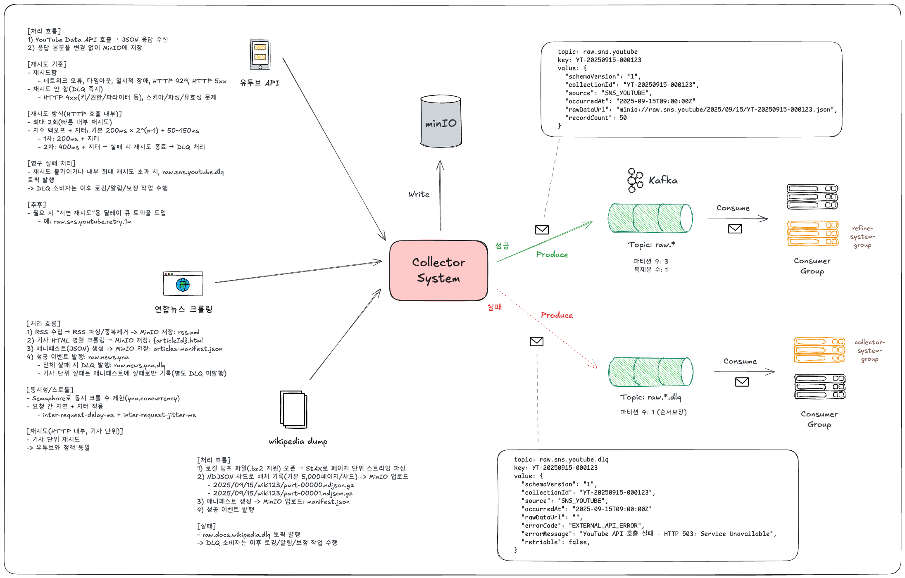

# Collector System | 데이터 수집 시스템

- 외부 소스로부터 실시간 데이터를 수집하고 저장하는 시스템

## ☁️ 개요

- 위키문서, 뉴스(RSS), SNS 등의 원천에서 데이터를 수집하고, 성공/오류 이벤트를 Kafka로 발행합니다.
- 수집 데이터(원본/중간 산출물)는 MinIO 등 외부 스토리지에 저장되며 후속 시스템(Refine/Index/Serving)에서 소비됩니다.

## ☁️ 아키텍처


## ☁️ 프로젝트 구조

```
src/
├── main/
│   ├── java/com/realtime/collector/
│   │   ├── application/              # 수집 유스케이스 (Wikipedia, YNA, YouTube)
│   │   ├── domain/                   # 도메인 모델
│   │   └── infrastructure/           # 메시징, 설정, 클라이언트 등
│   └── resources/
│       └── application.yml           # 애플리케이션 설정
└── test/                             # 테스트 코드
```

### 의존 방향

```
Application → Domain ← Infrastructure
```

- Application: 유스케이스 조정, 수집 흐름 관리
- Domain: 핵심 모델/도메인 규칙
- Infrastructure: 외부 시스템 연동(Kafka, DB, MinIO 등)

## ☁️ 주요 기능

- Wikipedia 문서 수집 및 파싱: `WikipediaCollector`, `WikiParsingContext`
- YNA 뉴스(RSS) 수집: `YnaCollector`, 구성은 `YnaConfig`로 주입
- YouTube SNS 수집: `YouTubeCollector`
- 이벤트 발행: `CollectorEventPublisher`/`CollectorEventAsyncInvoker`가 Kafka에 성공/오류 이벤트 발행
- DLQ 소비: 영구 실패 이벤트를 `CollectorErrorConsumer`가 수신해 후처리 트리거


## ☁️ Kafka 토픽

- 토픽 상수는 `com.realtime.common.constants.KafkaTopics`에 정의되어 있습니다.
- 수집 소스별 성공/실패(DLQ) 토픽(논리명):

| 소스 | 성공 토픽 | DLQ 토픽 |
|---|---|---|
| Wikipedia | `RAW_DOCS_WIKIPEDIA` | `RAW_DOCS_WIKIPEDIA_DLQ` |
| YNA 뉴스 | `RAW_NEWS_YNA` | `RAW_NEWS_YNA_DLQ` |
| YouTube | `RAW_SNS_YOUTUBE` | `RAW_SNS_YOUTUBE_DLQ` |

DLQ는 `CollectorErrorConsumer`가 구독하며, 알람/조사/후처리 연계 지점을 제공합니다.

## ☁️ 실행 방법

### 1) 인프라 실행

```bash
# 수집 시스템 (mysql, kafka, minio) + 개발용 kafka-ui
scripts/compose-up-collector.sh
```

### 2) 빌드

```bash
# 전체 빌드
./gradlew build

# (선택) 공통 라이브러리 로컬 발행
./gradlew :common-lib:publishToMavenLocal
```

### 3) Collector 실행

```bash
./gradlew :collector-system:bootRun

# 또는 IDE에서 CollectorSystemApplication 실행
```
